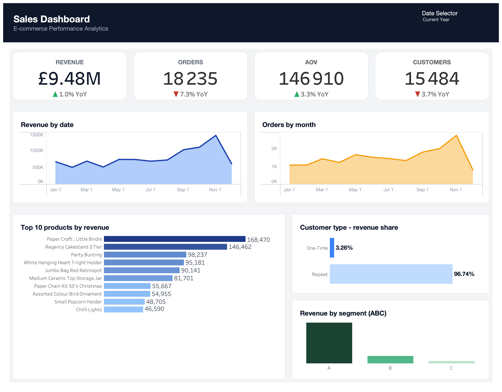

# Tableau Sales Dashboard

Interactive sales performance dashboard built in Tableau on top of the [Online Retail II](https://www.kaggle.com/datasets/lakshmi25npathi/online-retail-dataset) dataset.

This project complements `project-2-automated-sales-report`. Project 2 produces a static monthly Excel report; this project takes the same source data and delivers an interactive Tableau dashboard that lets a stakeholder filter, compare, and explore — without re-running any Python.

**Live dashboard:** [Tableau Public — E-commerce Performance Dashboard](https://public.tableau.com/app/profile/andrey.kolesnikov6456/viz/E-commercePerformanceDashboard_17775326018360/Dashboard)



---

## Output

A single Tableau workbook (`sales_dashboard.twb`) with one dashboard view containing:

| Section | Contents |
|---|---|
| Header | Dashboard title and a `Date Selector` parameter |
| KPI cards | Revenue, Orders, AOV, Customers — each with period-over-period comparison |
| Revenue trend | Daily revenue area chart for the selected period |
| Orders trend | Daily orders area chart for the selected period |
| Top products | Top 10 products by revenue (responds to the date filter) |
| Customer mix | Repeat vs one-time customer revenue share |
| Segment | Revenue by ABC product segment |

The `Date Selector` parameter offers six windows: All Time, Last 30 Days, Current Month, Last Month, Current Year, Last Year.

---

## Project Structure

```
├── data/
│   └── online_retail_II.xlsx                   # source dataset
├── tableau_data/                               # CSVs consumed by the workbook
│   ├── monthly_trends.csv
│   ├── top_products.csv
│   ├── abc_product_summary.csv
│   ├── abc_customer_summary.csv
│   └── repeat_vs_onetime.csv
├── project-3-tableau-sales-dashboard.ipynb     # data preparation notebook
├── sales_dashboard.twb                         # Tableau workbook
└── README.md
```

---

## Notebook Structure

```
1.  Introduction
2.  Business Problem
3.  Dataset Description
4.  Data Preparation
    4.1  Data Cleaning
    4.2  Feature Engineering
5.  Product Labels (Title Case normalization)
6.  Aggregations for Tableau
    6.1  ABC Analysis (Products)
    6.2  ABC Analysis (Customers)
    6.3  Repeat vs One-Time Customers
7.  Tableau Export
    7.1  monthly_trends.csv
    7.2  top_products.csv
    7.3  abc_product_summary.csv
    7.4  abc_customer_summary.csv
    7.5  repeat_vs_onetime.csv
    7.6  Summary
8.  Dashboard
```

---

## CSV Schemas

### `monthly_trends.csv`

| Column | Type | Notes |
|---|---|---|
| `Month` | date | One row per **day** despite the name (kept for backward compatibility with the Tableau workbook) |
| `Revenue` | float | `quantity × price` |
| `Orders` | int | Distinct invoices |
| `AOV` | float | Revenue / Orders |
| `Unique_Customers` | int | Distinct `customer_id` |

### `top_products.csv`

| Column | Type | Notes |
|---|---|---|
| `Month` | date | Day-level granularity |
| `Stock_Code` | string | Trimmed |
| `Description` | string | Title Case (e.g. `Paper Chain Kit 50's Christmas`) |
| `Revenue` | float | |
| `Units_Sold` | int | Sum of `quantity` |
| `Orders` | int | Distinct invoices for the product on the day |

### `abc_product_summary.csv` / `abc_customer_summary.csv`

| Column | Type |
|---|---|
| `Segment` | string (`A` / `B` / `C`) |
| `Products` or `Customers` | int |
| `Revenue` | float |
| `Revenue_Share_Pct` | float |

### `repeat_vs_onetime.csv`

| Column | Type |
|---|---|
| `Customer_Type` | string (`Repeat` / `One-Time`) |
| `Customers`, `Orders`, `Revenue` | numeric |
| `Revenue_Share_Pct`, `Customer_Share_Pct` | float |
| `Avg_Revenue_Per_Customer`, `Avg_Orders_Per_Customer` | float |

---

## Design Notes

**Why daily granularity for trend files.** Both `monthly_trends.csv` and `top_products.csv` are exported at day level, even though the dashboard primarily shows monthly aggregates. The reason is interactivity: the `Date Selector` parameter exposes windows like *Last 30 Days* and *Current Month*, which require day-resolution input. Tableau aggregates back up — keeping it daily means one CSV powers every time window.

**Why ABC and customer-mix are full-period.** ABC analysis describes the structural composition of the customer/product base, not a trend. Filtering it by date would distort the segments. The same logic applies to repeat vs one-time classification — a customer is "repeat" based on lifetime invoice count, not the current filter window.

**Why Title Case.** Raw descriptions are ALL CAPS, which is hostile in a dashboard — every product label shouts and the eye has nothing to anchor on. We normalize with a custom `title_case` function (split-by-whitespace + per-word `.capitalize()`) that preserves possessives correctly: `50'S` → `50's`.

---

## Stack

- Python 3
- pandas
- numpy
- Tableau Desktop / Tableau Public Desktop (workbook saved with version 18.1)

---

## How to Run

```bash
pip install pandas numpy openpyxl kaggle

jupyter notebook project-3-tableau-sales-dashboard.ipynb
```

Run all cells top to bottom. The five CSVs land in `tableau_data/`.

Then open `sales_dashboard.twb` in Tableau Desktop. The workbook resolves data sources via relative paths, so as long as the folder structure above is intact, it opens without re-mapping.

---

## Dataset

**Online Retail II** — UCI Machine Learning Repository / Kaggle.
UK-based non-store online retailer, transaction data from December 2009 to December 2011.

To run the notebook, place `online_retail_II.xlsx` in `data/`, or configure Kaggle API credentials — the notebook will download the file automatically if it is not found.
