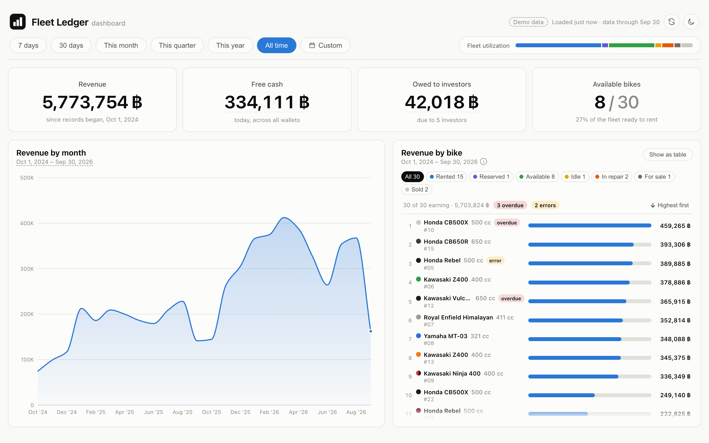
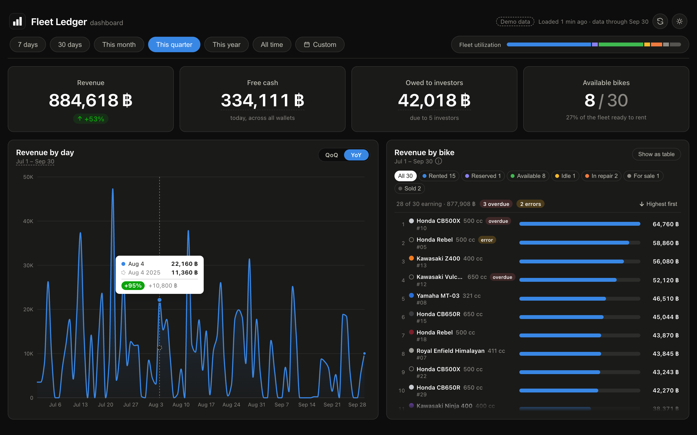
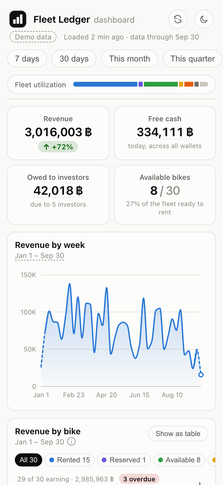
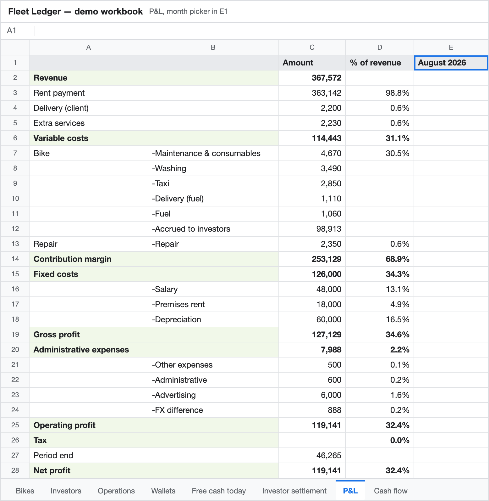
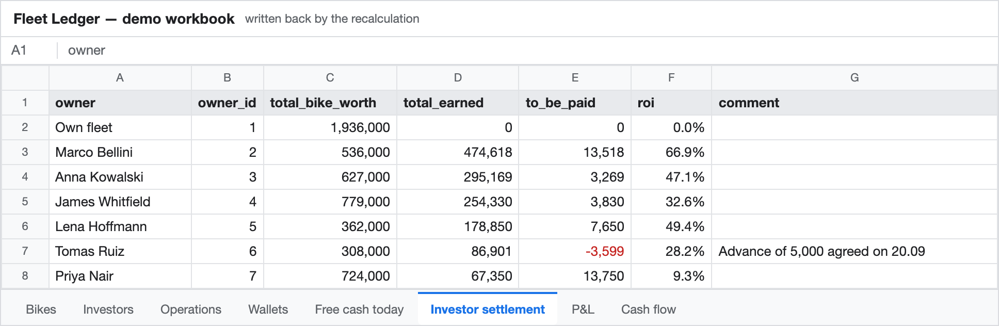
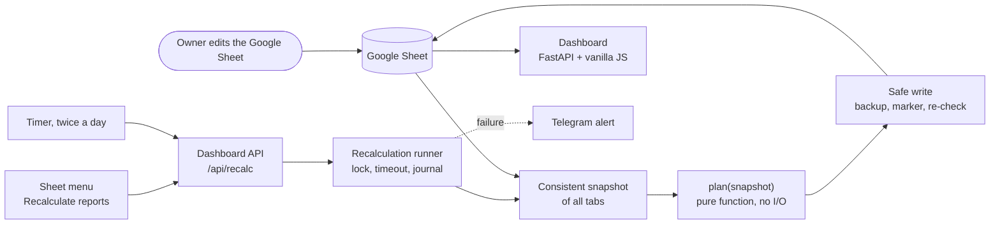

# Bike Rental Finance System

An automated finance back-office for a small rental business that lives in Google Sheets: P&L, cash flow, free cash and what the business owes each investor, recalculated at the press of a menu item and shown on a live dashboard.

**Live demo:** LIVE_DEMO_URL (no login, runs on synthetic data)



---

## The problem

A bike rental business was run from a single Google Sheet. Every rental, repair, deposit, salary and investor payout was entered there, and the owner knew the day-to-day well. What nobody could say was the bottom line:

- Is the business in profit or in loss this month, and by how much?
- How much of the money in the wallets is actually free to take out, and how much belongs to customers (deposits), to investors, or to next week's payroll?
- How much is each investor owed? Several investors own different bikes under different profit-sharing terms, and payouts were made by eye.

Nothing was reconciled. Answering any of these meant an afternoon with a calculator, and the answers were rarely trusted.

## The solution

The owner keeps working in the same spreadsheet, with the same tabs and the same habits. A calculation engine reads the sheet, works out the numbers, and writes the reports back into it. A small web dashboard shows the result on a phone.

What changed for the owner:

- **P&L, cash flow and per-bike ROI** are always current. Pick a month and the P&L tab shows it.
- **Free cash** is one number, with the reasons visible: wallets, minus customer deposits not yet returned, minus accrued-but-unpaid investor money, minus upcoming fixed payments, minus an operating reserve.
- **Every investor's balance** is calculated automatically from who owned which bike when, at what share of income and of repairs. A mistake in the sheet is reported in plain words instead of silently producing a wrong total.
- **Recalculation is one click**: *Fleet Ledger → Recalculate reports* in the sheet's menu. It also runs on a timer twice a day, and failures arrive as a Telegram message.
- **Nothing to learn**: no new tool, no migration, no export. The sheet stays the single source of truth.

## Live demo

The demo runs the real dashboard and the real calculation on **two years of synthetic data (about 4,000 operations)**, generated to match the operating patterns of a rental business: seasonality, typical rental lengths, deposits, payouts. The fleet grows from 10 to 30 bikes, six fictional investors join along the way, and the high and low seasons are clearly visible. No real customer, investor or amount appears anywhere in this repository.

**Live demo:** LIVE_DEMO_URL

Or run it locally in one command, see [Run locally](#run-locally).

| Dark theme, this quarter vs. the same quarter last year (hover shows the comparison) | Phone, this year |
|---|---|
|  |  |

The dashboard shows revenue with a comparison against the previous period or the same period last year, free cash and how it is made up, what is owed to investors, fleet utilization, and revenue per bike. It also flags what needs attention: overdue rentals, and rent payments with no end date.

### What the owner sees in the spreadsheet

The same engine writes the reports back into the workbook. These two tabs are rendered from the demo data.





The negative figure in the second table is intentional: one investor was advanced more than they had earned so far, and the system says so (and does not count it as free cash) instead of hiding it.

## How it works



1. **Read.** One batched request reads every tab twice (as typed values and as formulas) and checks that nothing changed in between. The result is a *snapshot*.
2. **Plan.** `plan(snapshot)` is a pure function. It parses operations, assigns each to a bike, wallet and investor, builds P&L, cash flow, free cash, investor accruals and ROI, and returns the exact list of cells to change, plus the reports in a form people can read. It does no I/O.
3. **Write.** The plan is applied in a single atomic request, guarded as described below. If every value is already correct, nothing is written.
4. **Show.** The dashboard reads the same sheet (cached for a few minutes) and presents the numbers.

A recalculation can be started three ways: from the menu inside the spreadsheet (a small Apps Script), by a systemd timer, or by calling the API. All three go through the same runner.

## Key engineering decisions

**`plan(snapshot)` is a pure function.** All network access lives in one module. The calculation takes rows in and returns cell writes out, so the whole engine is tested without Google, in milliseconds, against a synthetic workbook. It also gives a dry run (`--dry-run`) for free: the exact before/after diff of every cell, with nothing written.

**Idempotent by construction.** Run the calculation on its own output and it plans nothing. This is tested on the demo data, and it is what makes a timer every few hours safe: an unchanged sheet produces no writes, no edit history noise and no API quota use.

**Safe writes into a live spreadsheet.** The sheet is the owner's working document and can be edited at any moment, so the write path is defensive:

- the engine may only write specific output columns; the owner's input columns, formatting and dropdowns are off limits, and the history tab is only appended to (existing dates and shares are never rewritten);
- before writing, the previous values and formulas are saved to a timestamped backup file;
- a *pending* marker file is created before the request and removed only after Google confirms it. If the outcome is unknown (a timeout, a server error), the marker stays and the next run refuses to start until a person has checked the sheet;
- the sheet is compared with the snapshot twice, once before the marker and once after it, and the run aborts if the owner edited anything in the meantime;
- the write is a single `batchUpdate`, so it is applied entirely or not at all;
- rate-limit responses (HTTP 429) are retried with a pause; ambiguous failures are not retried, because a retry could double-apply.

**The calculation moved from a notebook into a package without changing a number.** The first version was a Jupyter notebook (kept in `notebooks/` for exploration). Moving it into a tested package was verified by running both against the same copy of the live workbook and comparing the outputs cell by cell.

**Stable investor IDs.** Investors are identified by a permanent number, not by name, so renaming a person does not rewrite history, and a deleted investor's number is never given to a new one. Bike ownership is a dated history, so changing an owner or a share affects only the future. See [docs/investor-ids.md](docs/investor-ids.md).

**Errors are written for the owner, not the developer.** A bad date, an unknown investor, a duplicate ID: the run stops, nothing is written, and the last line of the log (for example `ERROR: Bike history, row 7: active_from date is required.`) is what the owner sees in the sheet's toast and in the Telegram alert.

**One recalculation at a time.** The runner holds a host-wide lock, runs the calculation as a child process with a timeout, keeps a durable journal of the last runs, and exposes the status to the sheet menu. An interrupted run is visible as such rather than silently lost.

**Deploys with a key that can only deploy.** CI runs the tests first. In production, the deploy step logs in with an SSH key restricted to a forced command, so the key can run one script and nothing else. The script waits for a running recalculation (so a deploy never swaps code under it), installs the package, restarts the service, and fails loudly unless a health check passes. See `deploy/`. This portfolio copy keeps the test job and leaves out the deploy job.

**Alerts when it matters.** A failed recalculation, a timer run that could not even start, or a write whose outcome is unconfirmed all send a Telegram message. If Telegram itself is down, that never changes the result of a run.

**Single-owner login that fails closed.** The dashboard uses one account with a salted PBKDF2 password hash and a signed session cookie, with a lockout after repeated failures. If the account is not configured, only requests from the machine itself are let in, so a misconfigured server does not expose the numbers to the internet.

## Data model

The workbook is the database. Nine tabs hold the owner's input, five hold results written by the engine.

| Tab | Kind | Contents |
|---|---|---|
| `Bikes` | input | One row per bike: model, color, owner, owner share, repair share, purchase price, status. ROI is written back |
| `Investors` | input | Directory of investors with permanent `owner_id`. Optional settlement columns for incomplete early history |
| `Operations` | input | Every cash movement: date, operation, wallets, amount (and original-currency amount), bike, end date for rentals |
| `Operation types` | input | Names of operations and whether each is income, expense, a transfer, or either |
| `Wallets` | input | Bank account, cash, card and a crypto wallet. The currency is part of the name |
| `Opening balances` | input | Starting balance per wallet and the deposits held at the start |
| `Bike history` | input and appended | Dated owner and share changes, per bike. The engine only appends here |
| `Staff` | input | Employees, start and end dates, monthly salary |
| `Fixed costs` | input | Recurring costs and their schedule, such as `5th and 20th` |
| `Free cash today` | output | Wallets minus deposits, minus accrued investor money, minus upcoming fixed payments, minus a reserve |
| `Investor settlement` | output | Per investor: bike value, earned, remaining to pay, ROI |
| `P&L` | output | Revenue to net profit for the selected month, in amounts and as a share of revenue |
| `Cash flow` | output | Cash at the start, operating, investing and financing flows, cash at the end |
| `Month start days` | output | Helper table for month boundaries and the month picker |

Two input tabs also carry a few columns the engine fills in: `Operations` gets the resolved owner, bike and signed total (the only columns it may write there, enforced in code), and `Bikes` gets the full name, ROI and owner labels.

Money is tracked in baht (฿), with wallets in other currencies. When a rental is paid in a cryptocurrency or a foreign currency, the original amount and the rate are recorded, and the difference at conversion shows up as an *FX difference* line instead of silently disappearing.

## Run locally

Python 3.12 or newer.

```bash
python3 -m venv .venv
.venv/bin/pip install -e ".[dashboard,test]"
```

Start the dashboard on the demo data (no Google account, no keys, no login):

```bash
./dashboard/start.sh --demo
```

Then open <http://127.0.0.1:8000>. Use `PORT=8010 ./dashboard/start.sh --demo` if the port is busy.

Run the calculation on the demo snapshot from the command line, which prints free cash, cash flow, P&L, investors and the write plan, and finishes with `Write plan: 0 cells`:

```bash
.venv/bin/python -m fleet_ledger --snapshot demo/snapshot.json
```

Regenerate the demo data (deterministic, fixed seed):

```bash
.venv/bin/python -m fleet_ledger.demo
```

To point the dashboard at a real spreadsheet, copy `dashboard/backend/.env.example` to `.env` and fill it in. The engine looks tabs up by their titles. Numeric tab IDs are an optional override (`SHEET_IDS`).

## Tests and CI

```bash
.venv/bin/python -m unittest discover -s tests
node tests/test_frontend.cjs && node tests/test_apps_script.cjs
```

Python tests cover parsing, ledger and report math, deposits and fuel, investor accruals and ID handling, the write path and its failure modes, the recalculation runner, alerts, and the demo (deterministic output, a second run that plans nothing, the API answering with all blocks filled). Node tests cover the dashboard's formatting and charts and the Apps Script menu. GitHub Actions runs both on every push and pull request.

## Stack

| Layer | Technology |
|---|---|
| Calculation | Python 3.12, pandas |
| Spreadsheet I/O | gspread, Google Sheets API |
| Dashboard backend | FastAPI, uvicorn |
| Dashboard frontend | Vanilla JavaScript, hand-written SVG charts, no framework |
| Spreadsheet menu | Google Apps Script |
| Operations | systemd timer and services, Telegram alerts, a forced-command deploy script |
| Quality | `unittest`, Node test scripts, GitHub Actions |

---

Shown for portfolio purposes. All data in this repository is synthetic.
